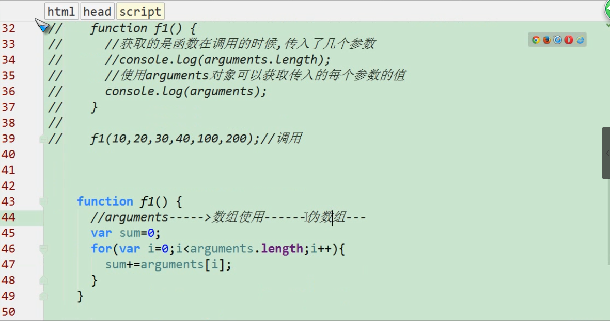
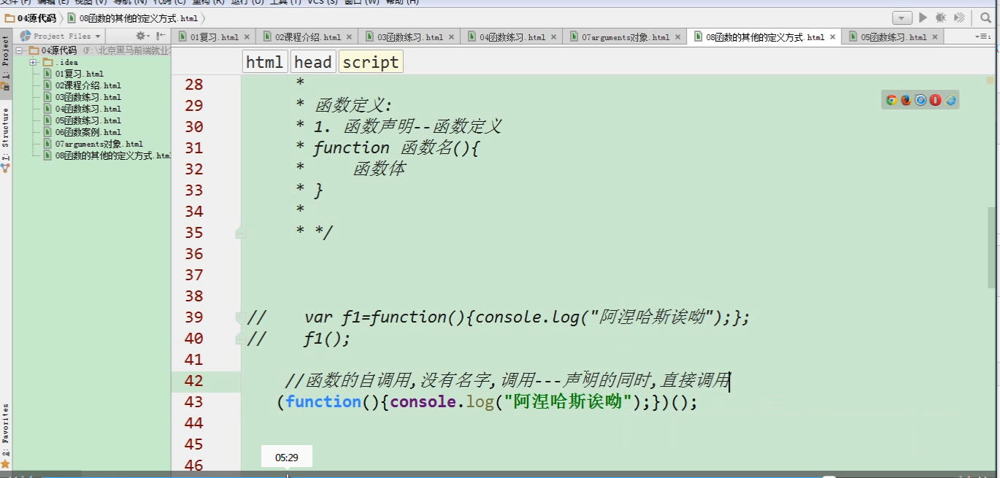

# JavaScript基础 #
1.什么情况下是undifind:变量声明了,但是没有定义.
如果一个undifind的数和一个数字进行计算,结果是:NaN,即not a number,不是一个数字,也没有什么意义.

	isNaN()			// 意思是:括号中的数字   是不是  不是  一个数字  ?
	isNaN(10)     	// 结果:false 

2.如何获取一个变量的数据类型?

(1) 使用typeof 获取变量的类型:

	1.typeof 变量名 
	2.typeof(变量名)

	var numb=10;
	console.log(typeof numb); // number

(2) js中的进制!
	
	var num=10;			// 十进制
	var num=012;		//八进制
	var num=0X123		//十六进制

(3) 数字范围类型有范围

	console.log(Number.MAX_VALUE);	//数字的最大值

**不要用小数去验证小数,其中有个bug**

(4) **伪数组:**  `arguments`

function f1(){
	coneole.log('xxxxxx')
}
	f1()					// f1指的是函数名,存储的是f1中的所有代码,
比如:console.log(f1)		

结果是: 

	f f1(){
	coneole.log('xxxxxx')
	 }

# 匿名函数 #

## 匿名函数不能直接调用 ##
	
	var f2=function (){					//函数表达式 
		console.log("xxxxxx");
	};
	
**将匿名函数直接赋值给f2了,解决了匿名函数不能直接用的问题!**	

匿名函数的调用:

	f2();  

特殊:f1()  小括号前是函数的代码;

## f1()  同理想到---->      (函数代码)()   ----->(function(){console.log("xxxx")};)() ##

## 函数的自调用(只能使用一次): ##

把一个函数给一个变量,此时形成了一个函数表达式!		--> var 变量=匿名函数
*注意:*函数表达式后面赋值结束后,一定要有分号 !

函数名();  // 函数的调用

# 回调函数 #

**函数可以作为参数使用,如果一个函数作为参数,那么,我们说这个参数(函数)可以叫做, 回调函数;
只要看到一个函数作为参数使用了,那就是回调函数!** 

**1.js没有块级作用域(函数除外);**
**2.隐式全局变量:没有用var声明的变量,叫做隐式全局变量.**

	function f1(){
		num=100;// 这是个隐式全局变量,外面也可以访问
	}
**3.全局变量是不能被删除的,隐式全局变量是可以被删除的,定义变量使用var是不会被删除的,没有var是可以删除的.**
**4.函数调用之前,会把函数的声明提升到这个函数作用域的上面, **

## 预解析 ##
js解析器在执行js代码的时候,分为两个过程,预解析过程和执行过程.

1. 把变量的声明提升到当前作用域的最前面,只会提升声明,不会提升赋值;
2. 把函数的声明提升到当前作用域的最前面,只会提升声明,不会提升调用;
3. 先提升var,在提升function;

预解析中,变量的提升只会在当前的作用域中提升,提前在当前的作用域的最上面,函数中的变量只会提升到函数的作用域的最前面,不会出去.

	f1();	// 调用 -->函数调用之前,会把函数的声明提升到这个函数作用域的上面
	var num=20;	//这个变量的声明会提升到变量的使用之前.---->也就是说声明在前,赋值在后(预解析).
	function f1() {
		console.log(num)
		var num =10;
	};
	
