# The-study-of-VUE.js
#splice(数组)
 + 用法：array.slice(startindex,endindex)
 + startindex开始位置的索引,结束位置的索引
 + 截取字符串,含头不含尾
 + 如果不传入参数二，那么将从参数一的索引位置开始截取，一直到数组尾

`
var a=[1,2,3,4,5,6];
var b=a.slice(	0,3);    //[1,2,3]
var c=a.slice(3);       //[4,5,6]
`

 如果两个参数中的任何一个是负数，array.length会和它们相加，试图让它们成为非负数，举例说明：
 当只传入一个参数，且是负数时，length会与参数相加，然后再截取

`var a=[1,2,3,4,5,6];
var b=a.slice(-1);    //[6] `

当只传入一个参数，是负数时,并且参数的绝对值大于数组length时，会截取整个数组	

`
var a=[1,2,3,4,5,6];
var b=a.slice(-6);    //[1,2,3,4,5,6]
var c=a.slice(-8);    //[1,2,3,4,5,6]
`

//当传入两个参数一正一负时，length也会先于负数相加后，再截取

`
var a=[1,2,3,4,5,6];
var b=a.slice(2,-3);    //[3]

`
//当传入一个参数，大于length时，将返回一个空数组

`
var a=[1,2,3,4,5,6];
var b=a.slice(6);　　//[]`
#splice(字符串)
- 举个简单的例子

`
var a="i am a boy";
var b=a.slice(0,6);    //"i am a" 
`
#splice(数组)
 + 用法：array.splice(start,deleteCount,item...)

解释：splice方法从array中移除一个或多个数组，并用新的item替换它们。参数start是从数组array中移除元素的开始位置。参数deleteCount是要移除的元素的个数。如果有额外的参数，那么item会插入到被移除元素的位置上。**它返回一个包含被移除元素的数组**。

举一个简单的例子

`var a=['a','b','c'];
var b=a.splice(1,1,'e','f');    //a=['a','e','f','c'],b=['b']`
#slice  ：
　　  定义：接收一个或两个参数，它可以创建一个由当前数组中的一项或多项组成的新数组，**注意是新数组哦~ 也就是说它不会修改原来数组的值。**

　　　　　用法：slice( para1 ),会截取从para1开始的到原数组最后的部分；

　　　　　　　　slice（para1,para2）会截取原数组的从para1开始的para2-para1个数组。 

　　　　**注意**：当两个参数中存在负数时，用原数组的长度加上两个负数的参数作为相应的参数来计算。

#总结

#split（字符串）

+ 用法：string.split(separator,limit)

解释：split方法把这个string分割成片段来创建一个**字符串数组**。可选参数limit可以限制被分割的片段数量。separator参数可以是一个字符串或一个正则表达式。如果

separator是一个空字符，会返回一个单字符的数组。

//再举一个简单的例子

`
var a="0123456";
var b=a.split("",3);    //b=["0","1","2"]
`
从空格所在的索引位置开始截取,截取3个	

 例如 ： str = “s-aaa-sss-eee-www”;

`targetArr = str.slite(“-”);	结果是 :[‘s’,’aaa’,’sss’,’eee’,’www’]`

2018-6-21 22:14:04

# 清除浮动的目的是为了解决父级元素因为子级元素浮动引起的高度为零的问题 #

四种定位的问题:定位一定要有宽和高,而且要写在宽和高前面

背景图片代码

`background:rgba(0,0,0,.4) url(imgs/xx.png) no-repeat center;`

##鼠标放上去 a里面的 mask显示出来

	vertical-aline 垂直对齐方式

图片**默认是基线对齐行,内标签**,

   有三种方式 基线:`vertical-aline:baseline;` 底线(bottom):居中(center)和顶部(top)

	注意,这个标签是加在img标签上的

什么是文字的基线?

# 一个小问题 #
*听说display:inline-block和vertical-align:middle;很配哦!!!!!*
因为图片或者块级别标签,和文字对齐的方式是基线对齐,所以有些时候,图片和文字在对齐的时候,很难对整齐,那么,就要用到一个属性,那就是`vertical-align:middle;`让块级标签对准文字的中线.这样句可以随便调整文字的高度.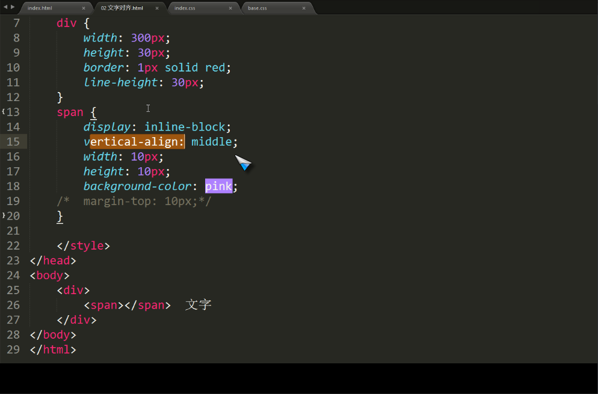

2018-6-22 22:55:03

## 滑动门的a标签 ##

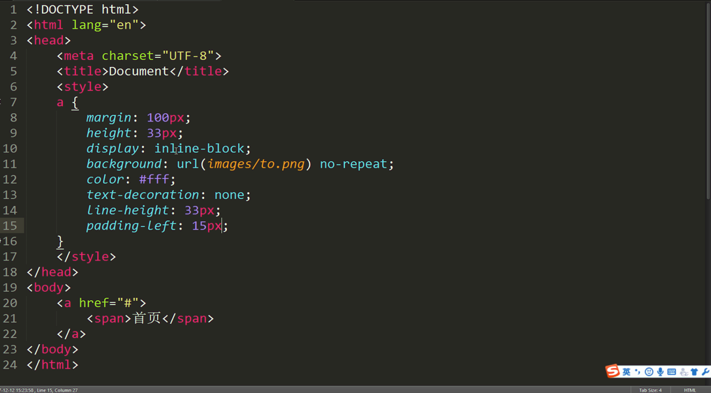   

在a标签中添加滑动门事件,**主要的原理是控制背景图片的来回切换**

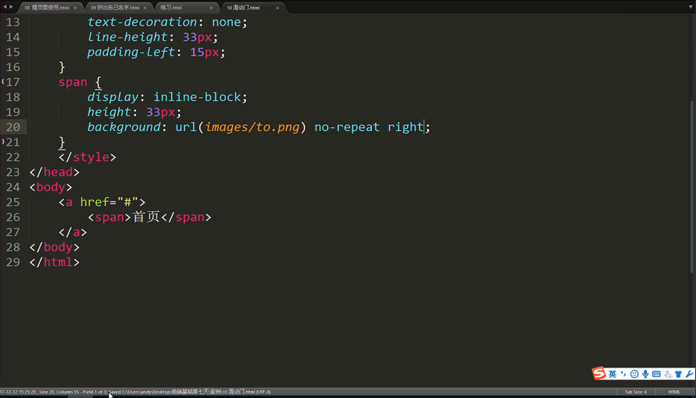

当鼠标移动上去的时候 ,图片变成凹下去的,这个凹下去的图片是用background-img做的 如图:

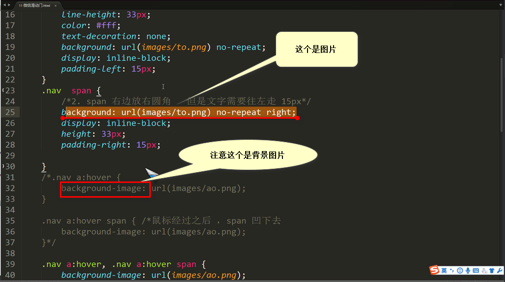

# 字体图标网址: [https://icomoon.io/](https://icomoon.io/)  #

在样式上中添加代码:

 		
	

	<body>
  		
  		

	</body>

**特别记住,当字体无法显示的时候,检查一下是否少了 font-family: 'icomoon';这个属性**
## 如何自创独一无二的字体图标? 

 在https://icomoon.io/官网上,有个导入的按钮,你只需要把后缀名字为xxx.svg发文件导入,就行,就会自定生成一个你自己的字体图标,点击就可以下载.这个.svg文件一般是美工做好的.

#如何在自己的原来的字体图标的基础上追加字体图标? #

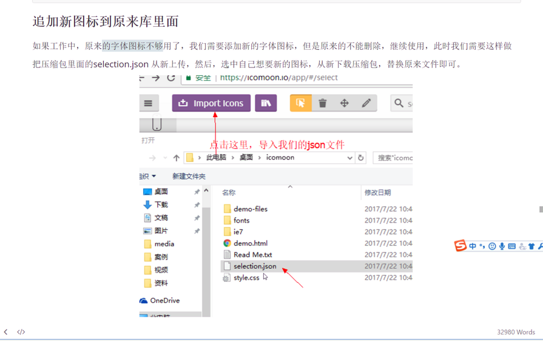

上传文件后,再次点击既想要你添加的图标,然后下载到本地即可!

 	淘宝ico 图标 [https://www.taobao.com/favicon.ico](https://www.taobao.com/favicon.ico) 

## log优化的问题 ##

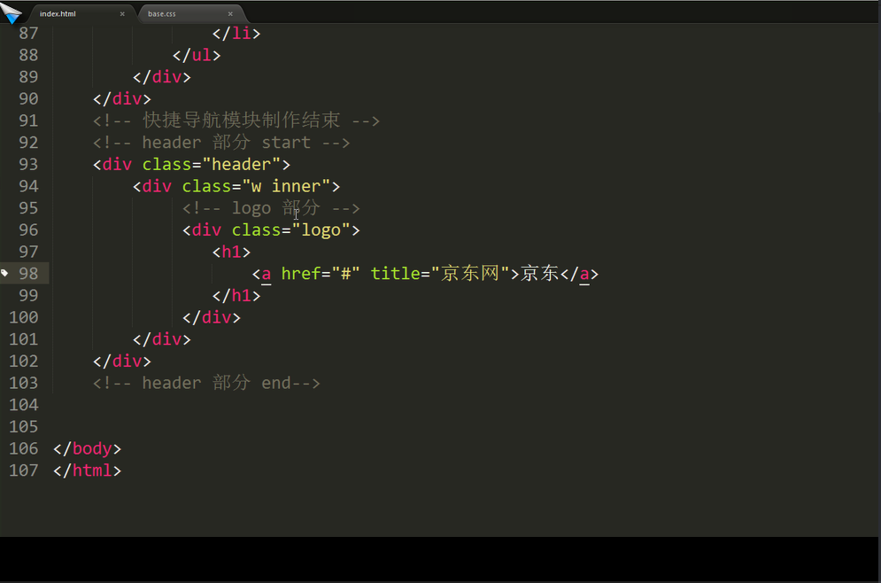
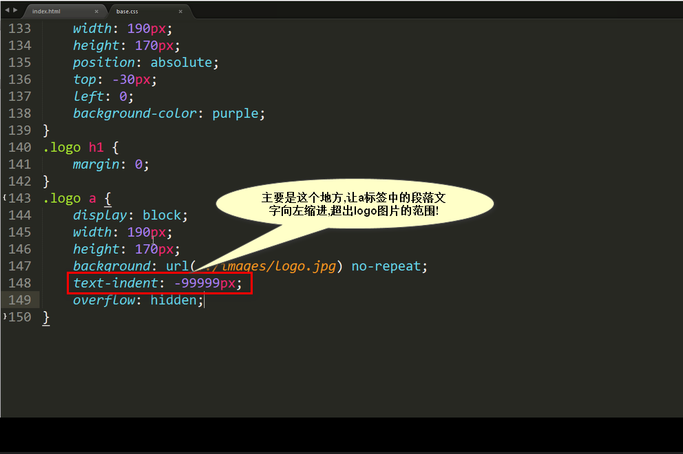

# 网页优化三大标签 SEO(搜索引擎优化)# 

1.<title>标签:首页标题:网站名(产品名)-网站介绍  例如:参考jd的title
2.<meta>标签:在百度上搜索京东的时候,显示的简单的介绍就是这个`name="description" content="xxx" `的内容,如下图:
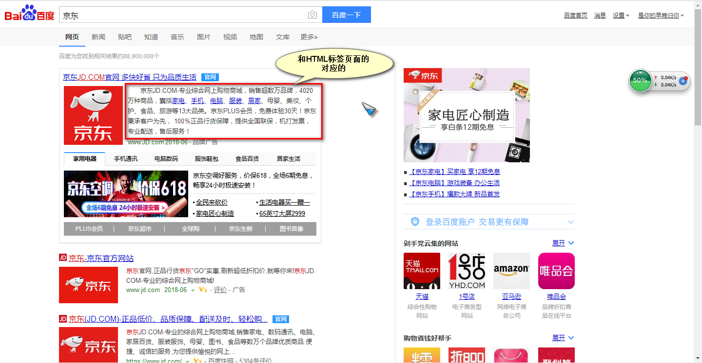

**上下两个图是对应的关系(图中content的文字内容不一样,并非同一个页面,知道怎么回事就行)**

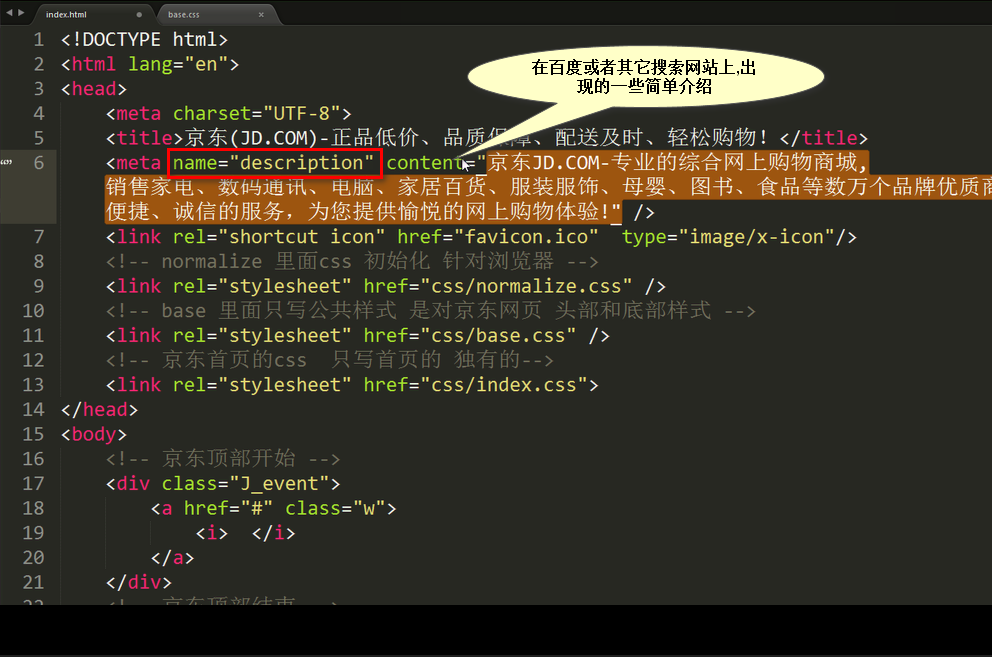

# Description-网站说明(百度28个中文56kb,谷歌35个中文70kb) #

# Keywords -网站关键字(6-8个左右) #

`name="keywords" content="xxx" `

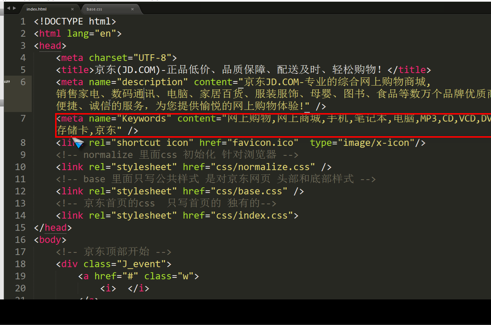

2018-6-24 10:39:57

**H5标签定义选项列表-datalist**
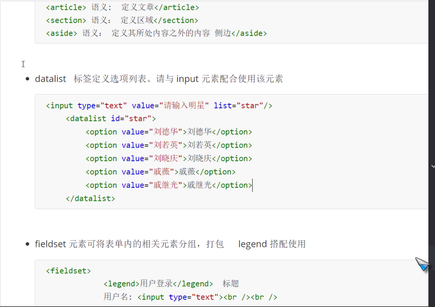

可以输入也可以下拉,类似百度搜索

	`<input type="text" value="请输入" list="star">
		<datalist id="star">
			<option value="刘德华"></option>
			<option value="刘若英"></option>
			<option value="刘备"></option>
			<option value="刘晓庆"></option>
			<option value="戚继光"></option>
			<option value="常委"></option>
			<option value="长威"></option>
	</datalist> `

** fieldset标签 **

	<form action="">
		<input type="text" required accesskey="s">
		<input type="submit" value="添加">
	</form>

accesskey标签属性 ,默认按哪个键会自动将光标移动到输入框中去,一般是设置 alt+s 
自动获取光标,在标签上加属性 autofocus

# 插入视频 #

很简单只要在代码中插入 一个连接就行  例如:跑男的连接o(*￣︶￣*)o

`<iframe frameborder="0" width="640" height="498" src="https://v.qq.com/iframe/player.html?vid=q00266ydgmr&tiny=0&auto=0" allowfullscreen></iframe>`

# 播放背景音乐 audio#

	<audio  autoplay controls loops>
		<source src="视频/bgsound.mp3">背景音乐mp3
		<source src="视频/music.ogg">背景音乐ogg
		<source src="视频/music.Wav">背景音乐wav
		你的浏览器不支持HTML音频播放功能
	</audio>

一般播放音乐的文件有三种模式,即后缀名为 .MP3 .ogg .wav  ,有浏览器会不支持,如果都不支持则显示 `你的浏览器不支持HTML音频播放功能` 这句话!

# 播放视频 video #

格式有 `ogg, mpeg 4(MP4), webm` 这三个格式!

	<video autoplay controls >
		<source src="视频/mp4.mp4">
		<source src="视频/movie04.ogg">
	</video>

可以设置视频的高度和宽度,其他的属性和播放视频一样,不在重复赘述!

# CSS结构伪类选择器 #

例如:
	<ul>
	    <li>1</li>
	    <li>2</li>
	    <li>3</li>
	    <li>4</li>
	    <li>5</li>
	    <li>6</li>
	    <li>7</li>
	    <li>8</li>
	</ul>

 	/* 选择第一个子标签*/
	ul li:first-child {
      background-color: brown
    }

	选择最后一个子标签
    ul li:last-child { 
      background-color: chartreuse
    }
	选择最后第五个子标签
    ul li:nth-child(5) {  
      background-color: crimson
    } 

    /* even 显示所有的偶数 */
    /* ul li:nth-child(even) {
      background-color: pink
    }

    /* odd 显示所有的奇数 */
    /* ul li:nth-child(odd) {
      background-color:purple
    }  */

    ** n是从0开始的所有自然数(0,1,2,3,4,5,6,7,8,9...), 如果是n,即代表显示所有的数  n代表第几个子标签**
    
	/* ul li:nth-child(n) {
      background-color: yellow
    } */

    /* 2n代表偶数类似even */
    ul li:nth-child(2n) {
      background-color: yellow
    }

    /* 2n+1代表偶数类似odd */
    ul li:nth-child(2n+1) {
      background-color: pink
    }
  

# css属性选择器 #

	
我爱jvaj

	
我爱jvaj</di>
	
我爱jvaj

	
我爱jvaj

	
我爱jvaj

	
我爱jvaj

	
没有

	
我爱jvaj

style中这样写:

	选择标签中clas=java的
	div[class=java] {
	  background-color: peru
	}
	选择标签中以class是以java开头的标签
	div[class^=java] {
	  background-color: peru
	}
	选择标签中以class是以java结尾的标签
	div[class$=java] {
	  background-color: peru
	}
	class*=java表示 只要class中有包含java的都行
	div[class*=java] {
	  background-color: peru
	}

**input[type=submit],只要是类型是等于submit的input框都行**这个就是属性选择器

# css3伪类元素 (默认行内元素)#
首先用一个p标签作为例子:
	 
淘宝网是亚太地区较大的网络零售、商圈，由阿里巴巴集团在2003年5月创立。淘宝网 [1] 是中国深受欢迎的网购零售平台，拥有近5亿的注册用户数，每天有超过6000万的固定访客，同时每天的在线商品数已经超过了8亿件，平均每分钟售出4.8万件商品。

**css3样式:**

    p::first-letter {
      font-size: 100px
    }
    p::first-line {
      color: orangered
    }
    p::selection{
      background-color: palegreen;
      color: red
    }

# css3伪元素before和after #
before和after是一个能插入元素的选择器

	<!DOCTYPE html>
	<html lang="en">
	
	<head>
	  <meta charset="UTF-8">
	  <meta name="viewport" content="width=device-width, initial-scale=1.0">
	  <meta http-equiv="X-UA-Compatible" content="ie=edge">
	  <title>Document</title>
	  
	</head>
	
	<body>
	  
	  

	</body>
	
	</html>
ps:可以是伪元素可以是一个冒号 `:`  ,也可以是两个冒号  `::`不过一般写两个冒号 

*注意:*

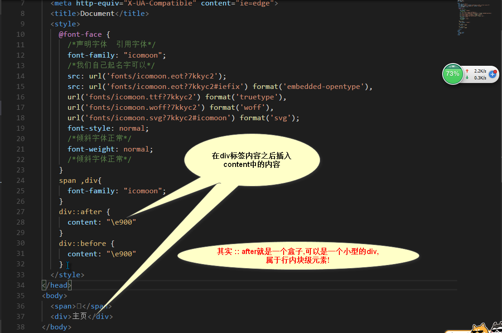

# css3盒子模型 #

box-sizing: border-box; 	/*内减模式*/
有这个属性,可以随便给盒子加padding和margin值,不会撑开盒子,属于内减模式,**盒子的大小为width,也就是说padding+border=定义好的盒子width**.
box-sizing: content-box; 	/*外加模式*/
**盒子的大小为我们给定义的width+padding+border=盒子最终显示宽度**.

添加透明效果代码 `border:1px solid red  rgba(255,255,255, 0.3);`

# 如何制作ico图标 #

[http://www.bitbug.net/](http://www.bitbug.net/ "比特虫")

点击这个网址,上传你要转换的图片最好是透明的图片,这个网站会把图片装换成ico图标.

**ps使用技巧**

如果你要切去一个图片中的logo,小型的图片可以直接用一下操作执行,无需切片.
点击'移动工具'的图标,选择你要的图标,然后找到该图标所在的图层,再次右击图层,选择'转换成只能对象'(这个时候没有任何反应,很正常),然后再次在这个图层上,右键'编辑内容',出现对话框,点击确定.将图片存储起来.即可,然后将图片上传到比特虫网站,进行icon转换.

**transition 过渡**  

transition:要过渡的属性(比如宽度从100到200) 要花费的时间  运动曲线  什么时候开始 

如:
 div{

	width:100;
	height:100;
	translation: width  .2s  ease  0s  ;   	一般谁做动画,过渡写在谁身上

}

div:hover{

	width:200;
	height:200;			// 当鼠标放上去的时候div从之前的100,长宽过渡到现在的200长宽

}

有多个属性可以用逗号隔开:

   	translation: width  .2s  ease  0s, height  .2s  ease  0s;
	translation: all  .5s;     				 //	一般情况下,后面两个一般不写 

**transform 变形**

  	transform:translate(100px,0)	;			//	translate(x轴 ,y轴)    位移
	//和上面的translation配合,尤其是时间,就是0.5秒是变形需要花费的时间

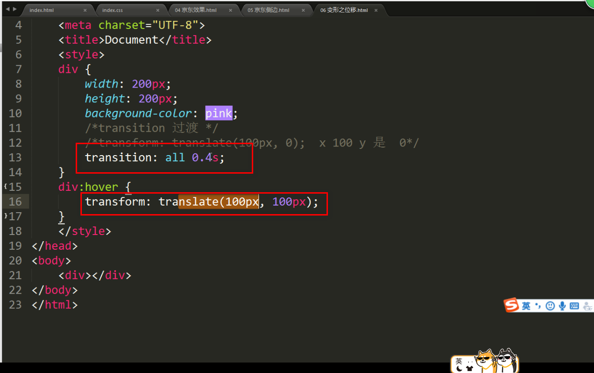

比如图中的transform:translate(50%,50%);			//这里面的50%是和父盒子没有关系,是以自身的为准.自身高度和宽度的一半.

translateX(50%)仅是水平方向移动50%
translateY(50%)仅是垂直方向移动50%

## 缩放 scale(宽度,高度)--##
	transform:scale(0.8,1);							// 0  --->0% 	1--->100%
	//水平宽度缩放原来的80%,垂直高度不变

	transform:scale(0.8)
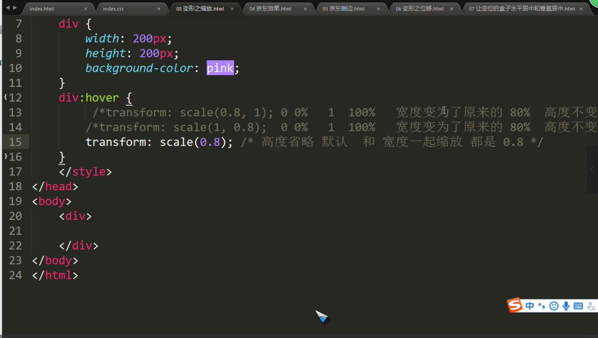

## 旋转	rotate(45deg)   ##

	transform:rotate(45deg)

45deg 顺时针旋转45度(deg)  -45deg是逆时针

transform-origin:

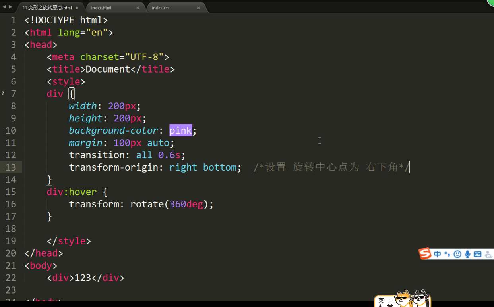

例子:

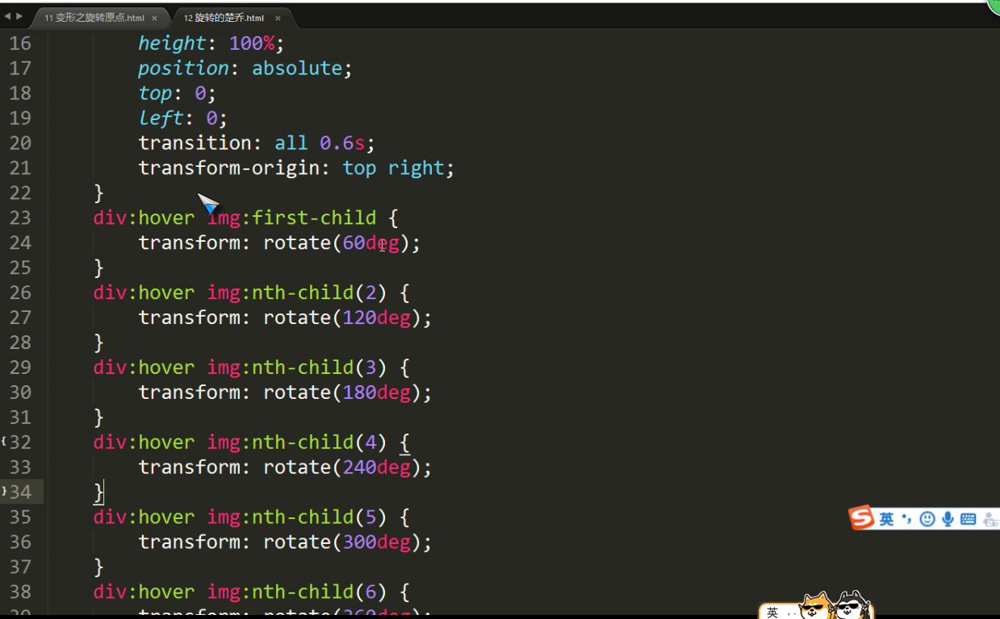

translation:all 0.6s ;   这个不能少,否则没有过渡效果出现

##倾斜 skew(deg,deg) ##

transform:skew(30deg,0deg)       //x轴倾斜30度,y轴不写默认为0

box-shadow: 0 10px 20px rgba(0,0,0,0.1);    // 配合transition:all 0.2s ; 就效果更好

# animation 动画效果 #
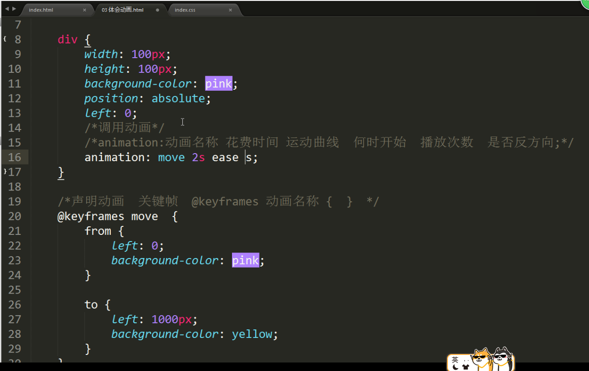

	 animation: move 2s ease 0s infinite(无限次数) alternate(来回播放)    

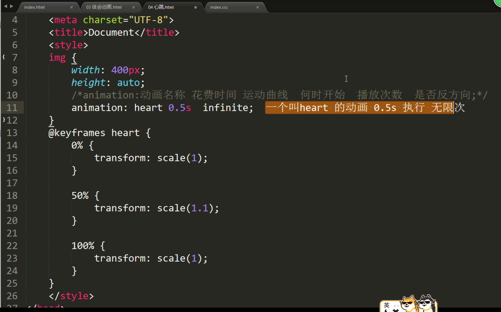

**只要这个动画备申明了,就可在本页任何css样式中调用**

# css3 flex #

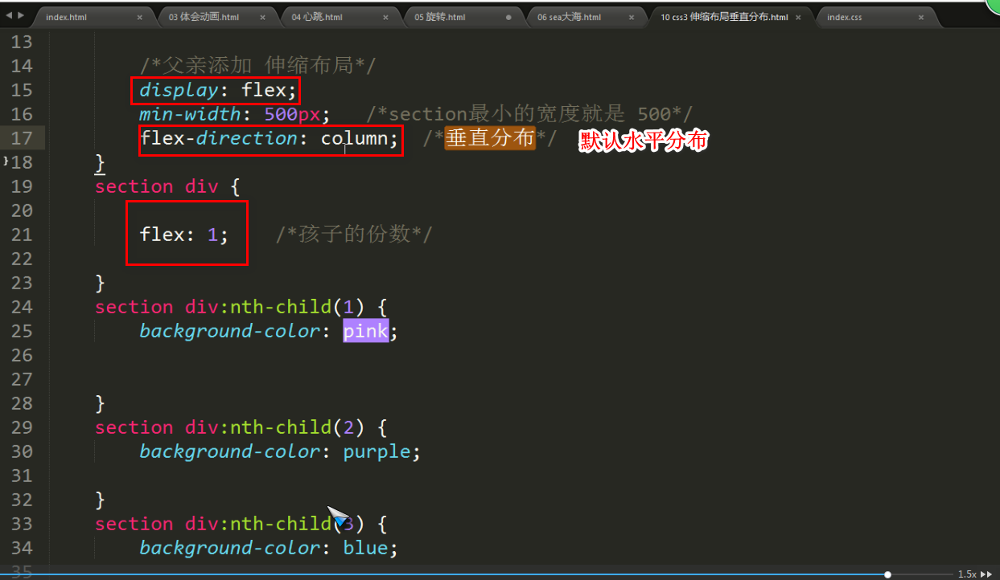