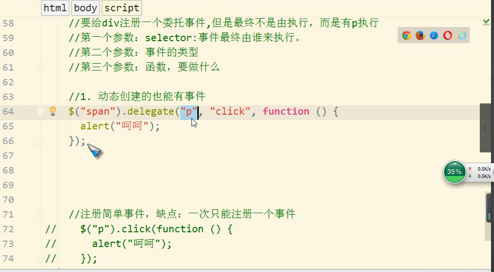
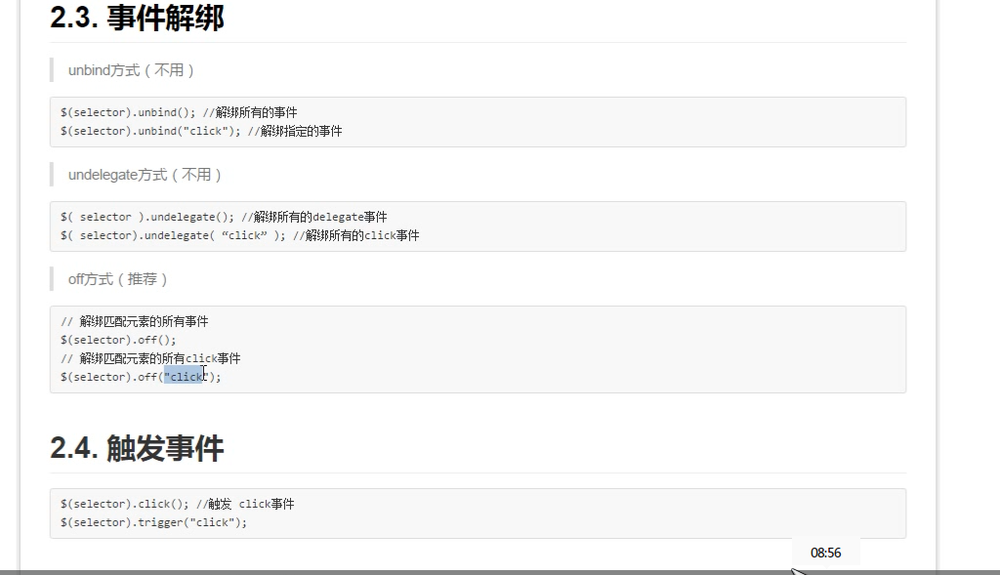
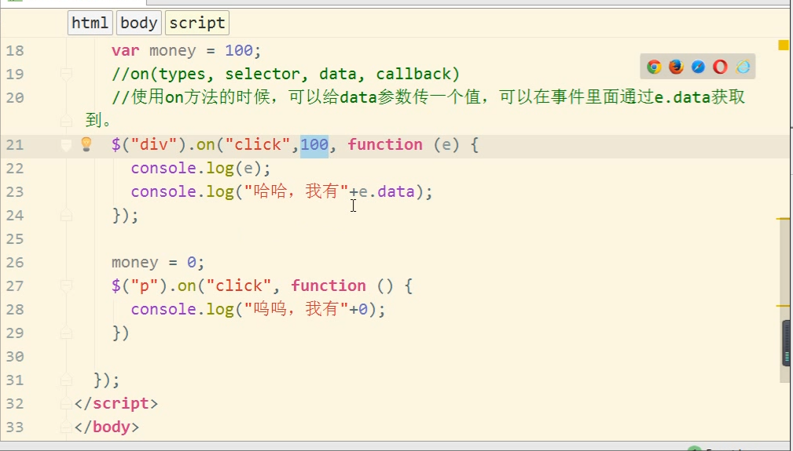
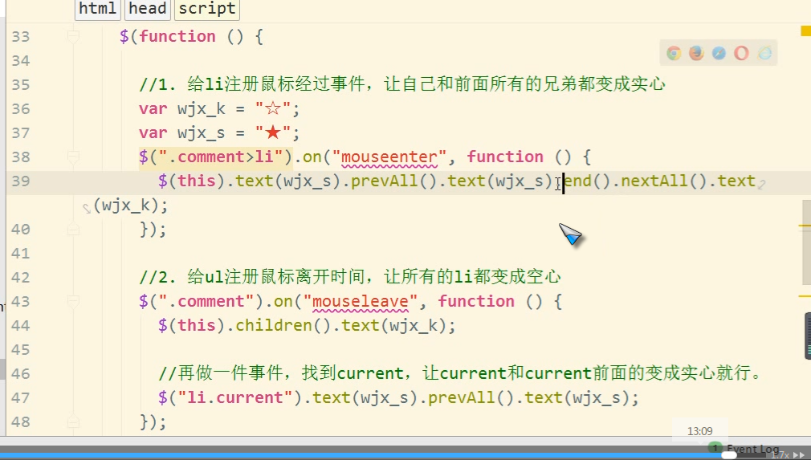
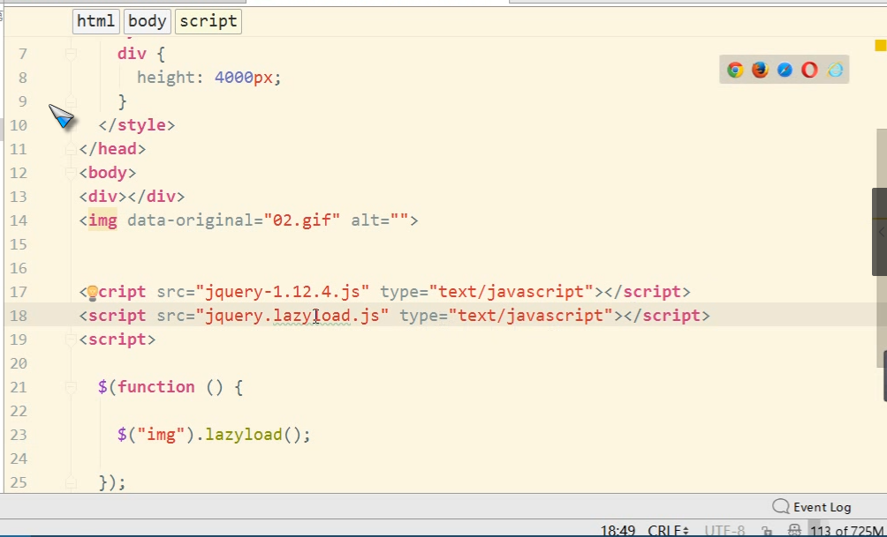
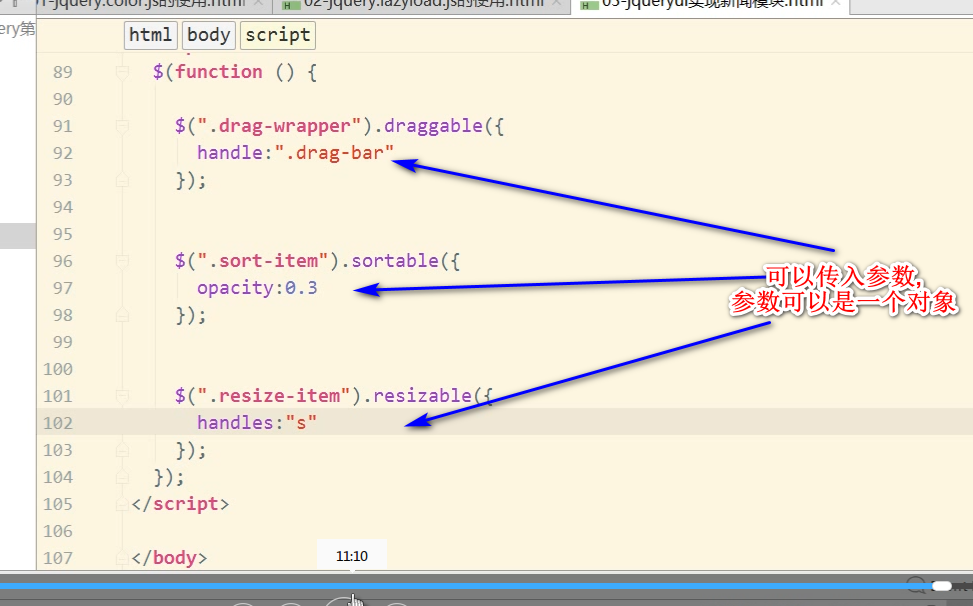

# jQuery #
jquery  1x支持ie678 国内一般用第一版  比如1.1.24.min.js压缩版本,一般用于生产环境.

jQuery的两个入口函数

1. $(document).ready(function(){$("#btn").click(function(){})};);
2. $(function(){};);		//无需等页面加载,即可执行,执行效率比jQuery高.
	
js的入口函数是:window.onload(function(){};); 			 // 必须等页面加载完成才执行,

**jQuery对象其实就是一个伪数组(伪数组就是,没有数组的方法,但是他有自己的方法),里面装着很多的js对象**	
DOM无法调用jQuery的方法,因为是两个不同的对象,但是DOM对象可以转换为jQuery对象,他们之间可以互相转换.

DOM对象转jQuery对象:

`var domObj=document.getElementById('id');`

`转换成jQuery对象:$(domObj).text("呵呵");`

jQuery对象转换成DOM对象:

直接从伪数组中取出来就行,通过下标取出来就行:

`var $li=$('li');`

`$li[0].style.backgroundColor='red';` //取出伪数组对象中的第一个DOM对象
或者也可以用第二种方法:$li.get(1);  //获取第二个li标签对象

## $符号的类型本质上是一个函数 ##

$的中参数的不同,用法不同,分别是以下三种用法:

1. 作为jQuery的入口函数:$(function(){};);
2. 作为将DOM对象转换为jQuery对象的方法;
3. 用来找到页面中的对象:$('#id');

## CSS操作 ##
 
1. 操作css属性,$('li').css('backgroundColor','red');
2. 同时也可以传入一个对象$('li').css.({'backgroundColor':"pink",'fondSize':"18px"})
3. 可以用来获取对象,$('div').css('backgroundColor');

## class操作 ##

addClass('basic');	//添加class

removeClass('basic'); //移除

hasClass('basic') ;//判断是否存在这个类.返回true/false 

toggleClass('basic'); 判断一个类是否存在,存在就移除,不存在就添加.

## 添加属性 ##

//设置单个属性
attr(name,value)
$('img').attr('alt','图破了');

//设置多个属性

$('img').attr({
alt:'图破了',
title:'这个是一张图片'
});

//获取属性

$('img').attr('title');

**注意:**
对于布尔类型的属性,不要用attr方法,应该用prop方法,prop用法和attr方法一样.

// stop停止正在执行的动画,在动画执行之前加,停止正在执行的动画,停止别人的动画让自己执行.

//$(this).children('ul').stop().slideDown();

**注意: var index=$(this).index()是获取jQuery对象下标的方法;$(this).eq(index)是获取对应元素的下标,返回的jQuery对象,而get(index)返回的是DOM的对象.**

## 添加元素节点 ##

添加父子级关系的标签:

 $('div').append($('p')); //追加加到子元素的最后面; 

 $('p').appendTo($('div')); //添加到子元素的最后面; 

 $('div').prepend($('p')); //添加到子元素的最前面; 

 $('p').prependTo($('div')); //添加到子元素的最前面; 

添加兄弟级别的标签:

 $('div').before($('p')); //div标签在p标签之前 属于兄弟标签;

## 清空内容和节点 ##
	$('div').html('');这个方法可以删除div中的内容,但是容易出现内存泄漏(他的原理是将div中的内容干掉,重新设置内容为空,),如果这个div标签上有注册了点击事件,那么虽然div上的内容空了,但是事件还是在的.所以,一般是用empty(),他会把也同时删除; 

$('div').remove();删除div自己本身这个元素;

## 元素clone克隆 ##

	clone()中参数默认是false,属于深度复制,但是不会复制事件.
	如果参数是true,不是深度复制,会复制事件.

`$('p').clone(true).appendTo('div');`

## 注册委托事件 delegate##

注意:要个父元素注册委托事件.

## on注册事件的两种方式 ##

## off 接触绑定事件的两种方式 ##

## 触发事件 trigger##

$(select).trigger('click');  触发click事件

**on方法中的data传参**

a标签阻止浏览器默认行为跳转有两种:在方法中直接return false(也能阻止冒泡行为) 或者 e.preventDefault();

**链式编程中的 end()方法的使用,就是让链式编程到时候,回到刚开始的时候的状态,也就是最初的那个对象**

五角星案例

## jQuery释放$的控制权 ##

	$.onConflict();  

释放控制权后,用jQuery(function(){});

	还可以这样有个返回值 : var $$=$.onConflict();
	$$(function(){});
	
## 图片懒加载(lazyload) ##

注意:将多张相同的图片都是加上相同的class,然后直接调用懒加载.

**jQuery相关的插件**

jQuery-ui的拖动效果

$('div').draggable();  //拖动组件

还有排序组件缩放组件等等...

##  如何封装jQuery的插件##
