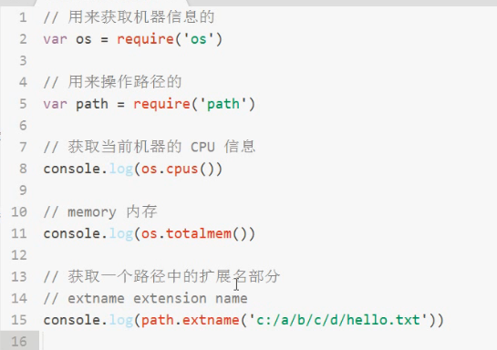
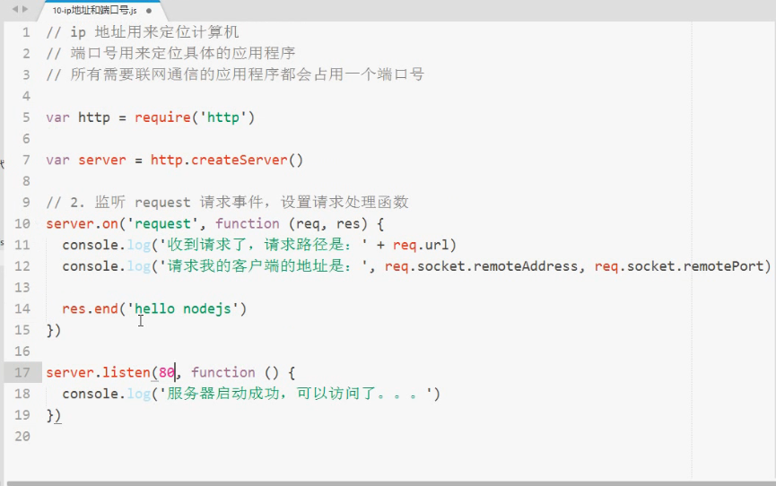
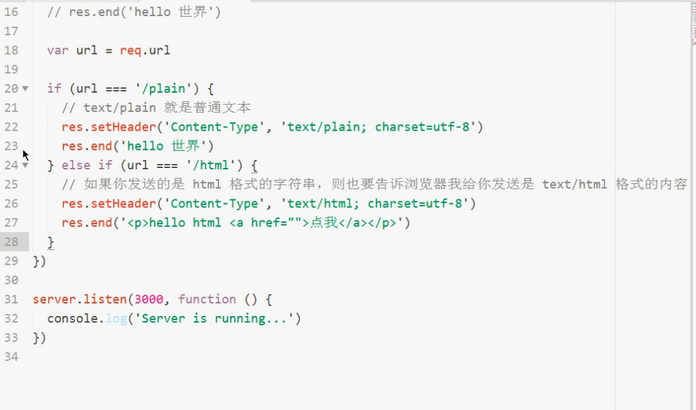

# 如何读取文件 #

# 写入文件 #

`var fs = require('fs');

fs.writeFile('./data/你好.md','大家好，我是大师兄！',function(error){
	console.log('文件写入成功！！！！')
})
`
# 简单的http服务器 #

`	var http = require('http')

	var server = http.createServer()

	server.on('request',function(request,response){
	
	var url = request.url;
	// response.end(url)
	if(url==='/login'){
		
	response.end('welcome!login');
	}else if(url=='/register'){
		
		response.end('register');
	}else if(url=='/hellow'){
		
		response.end('hahah');
	}else{
		response.end('404 not found');
	}
	})

	server.listen(3000,function(){
	console.log('服务服务器启动成功,可以通过http://127.0.0.1:3000/来进行访问')
	})`
**相应内容只能是二进制数据或者字符串,其他的都不行**

# nodejs中的一些核心模块 #

**require()模块之间的互相访问exports()**

## http的默认端口号 ##

## 相应头内容 ##

## 更具服务器请求的数据,返回文件中的内容 ##

**不同的资源对应的Content-Type是不一样的,图片类型的资源不需要指定编码,一般只为字符数据指定编码**

# 关于代码风格中的分号 ; 问题 #

